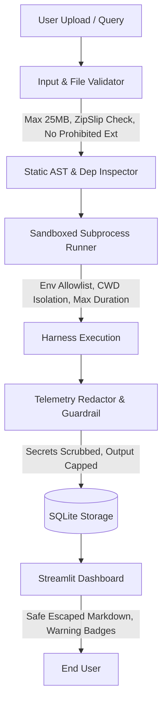

# Security Policy & Architecture Hardening

## 1. Overview & Threat Model
The **Agent Evaluation & Observability Framework** evaluates, benchmarks, and monitors AI agents, LLMs, and multi-step tool workflows. Because evaluated agents and user-uploaded projects may execute arbitrary code or handle untrusted prompts and responses, robust defense-in-depth safeguards are enforced across all telemetry, execution, and presentation boundaries.

---

## 2. Hardened Defense Boundaries

### A. Secret Redaction & Zero-Credential Exposure
- **Active Redaction Engine (`src/security/redactor.py`)**:
  - Scans all text, spans, step inputs/outputs, trace metadata, error logs, and JSON payloads.
  - Redaction patterns cover:
    - **OpenAI API keys**: `sk-proj-...`, `sk-admin-...`, `sk-none-...`, `sk-[A-Za-z0-9_-]{20,}`
    - **Anthropic API keys**: `sk-ant-api[0-9]{2}-[A-Za-z0-9_-]{20,}`
    - **Google Gemini API keys**: `AIzaSy[A-Za-z0-9_-]{33}`
    - **AWS Access Keys & Secrets**: `AKIA...`, `ASIA...`
    - **GitHub Personal Access Tokens**: `ghp_...`, `gho_...`, `ghu_...`, `ghs_...`, `ghr_...`
    - **HuggingFace Tokens**: `hf_[A-Za-z0-9]{20,}`
    - **Database Connection Strings**: `postgres://`, `mysql://`, `mongodb://`, `redis://` with user/pass masks
    - **Bearer Authorization Tokens**: `Bearer <token>`
    - **Private Cryptographic Keys**: RSA, OPENSSH, EC, DSA, PGP blocks
    - **Dictionary / JSON key-value pairs**: `password`, `secret`, `access_token`, `auth_token`, `api_key`, `client_secret`
- **Telemetry Hooks**:
  - `RunTrace.span()` and `RunTrace.log_step()` automatically scrub inputs and outputs.
  - `Span.sanitize()` and `Trace.sanitize()` provide deep recursive scrubbing.
  - `RedactingLoggingFormatter` intercepts standard library `logging` streams.
  - Engine persistence (`src/core/engine.py`) and runner (`src/runner.py`) apply a final sanitization pass before committing to SQLite.

### B. Sandbox Execution Boundaries
- **Process Isolation (`src/sandbox/sandbox_runner.py`)**:
  - Uploaded agents are executed in an isolated child subprocess with restricted working directory.
  - **Environment Allowlist**: Sensitive host credentials (e.g. `AWS_*`, `OPENAI_API_KEY`, `ANTHROPIC_API_KEY`, `GEMINI_API_KEY`, `SSH_*`) are **never** inherited by untrusted agent subprocesses unless explicitly authorized by the user per run.
  - **Execution Timeouts**: Enforced hard process timeout (`timeout_seconds`, default 60s). Subprocesses exceeding the timeout are forcibly terminated via process-tree kill (`SIGTERM`/`SIGKILL` on POSIX, `taskkill /T /F` on Windows).
  - **Resource Capping**: Output stdout/stderr streams are truncated to 500 KB to prevent memory exhaustion / log bombing.

### C. File Upload & Path Traversal Protections
- **ZipSlip & Path Traversal Defense (`src/sandbox/archive_extractor.py`, `src/security/validator.py`)**:
  - Validates archive paths against canonical destination directories using `Path.resolve()`.
  - Rejects entries with `..`, absolute paths, symlinks pointing outside target, and null bytes (`\0`).
- **Archive Size & File Count Limits**:
  - Max compressed archive size: **25 MB**.
  - Max uncompressed total size: **50 MB**.
  - Max file count per archive: **500 files**.
- **Blocked Prohibited Binaries**:
  - Rejects dangerous binary/script extensions: `.exe`, `.dll`, `.so`, `.dylib`, `.bin`, `.com`, `.scr`, `.msi`, `.vbs`.

### D. Input Validation & Prompt Injection Guardrails
- **Prompt Injection & XSS Heuristic Scanning (`src/security/validator.py`)**:
  - Detects system override patterns (`ignore all previous instructions`), jailbreaks (`DAN / developer mode`), credential harvesting queries (`reveal api key / env vars`), and SQL injection markers.
  - Replaces raw `<script>` tags with sanitized placeholders to eliminate Stored XSS vectors in UI dashboards.
- **Input Character Thresholds**:
  - Max single text input: **50,000 characters**.

### E. SQL Injection Immunity
- All relational operations utilize SQLAlchemy ORM with bound parameters and prepared statements.
- Direct string formatting/concatenation into SQL queries is strictly prohibited in the codebase.

---

## 3. Environment & Security Limitations Disclosure

> [!IMPORTANT]
> **Production Deployment Security Boundary Disclosure**
> 
> The built-in sandbox employs **Subprocess & Environment Variable Isolation** on the host operating system. While effective for local benchmarking, evaluation test harnesses, and preventing accidental credential leakage, it has known architectural limitations when running completely untrusted, adversarial multi-tenant code:
>
> 1. **Kernel Sharing**: Subprocess isolation shares the host kernel. An adversarial binary could attempt host kernel exploits or local port scanning unless containerized.
> 2. **Filesystem Boundaries**: Subprocesses have constrained working directories, but on Windows/Linux host accounts, operating system file permissions govern read access unless wrapped in a dedicated unprivileged user account or container.
> 3. **Recommended Production Setup**: For enterprise multi-tenant deployments evaluating untrusted third-party code, run the evaluation engine within disposable **Docker containers**, **gVisor sandboxes**, or ephemeral **AWS Firecracker microVMs**.

---

## 4. Security Verification & Testing
The framework includes dedicated security regression test suites in `tests/test_security_hardening.py` verifying:
- API key, token, and database URI redaction across all providers.
- ZipSlip and prohibited executable upload blocking.
- Output buffer truncation and resource limits.
- Prompt injection and XSS detection heuristics.
